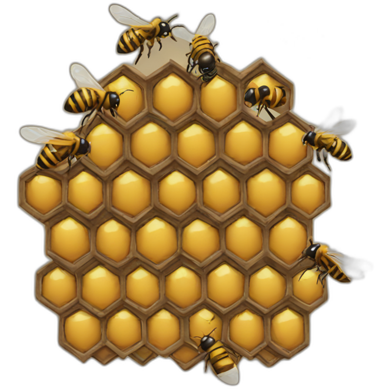

# HiveMind

HiveMind is a simulator for a fleet of edge devices that communicate via peer-to-peer, gathering local data, detecting anomalies, and gossiping insights across a mesh network — no central server required.

---

## Features

- Virtual edge nodes that simulate sensor or status data
- Lightweight gossip protocol for decentralized communication
- Local aggregation and anomaly detection at the edge
- Metrics retrieval for health, alerts, and node state
- Supports dynamic topology, partitions, and node churn

---

## Technologies

- **Rust**: Node agent, gossip protocol, local computation
- **Go**: API server, metrics aggregator
- **libp2p**
- Protobuf for messages

---

## Components

| Component                 | Description                                      |
|--------------------------|--------------------------------------------------|
| `edge_node`              | Simulated node: collects data, gossips, detects  |
| `gossip_layer`           | Peer-to-peer message distribution system         |
| `aggregator`             | Tracks average, stddev, and anomalies locally    |
| `dashboard`              | Real-time view of network state                  |
| `topology_simulator`     | Adds/removes nodes, simulates failure & latency  |

---

## Use Case Ideas

- Container or warehouse health data
- Energy microgrid availability
- Decentralized system monitoring (CPU, disk, etc.)
- Peer-to-peer IoT with no cloud dependency

---

## Setup

```bash
# Run multiple simulated nodes
cargo run --bin edge_node -- --id node1
cargo run --bin edge_node -- --id node2

# Run dashboard to observe state
go run ./dashboard
